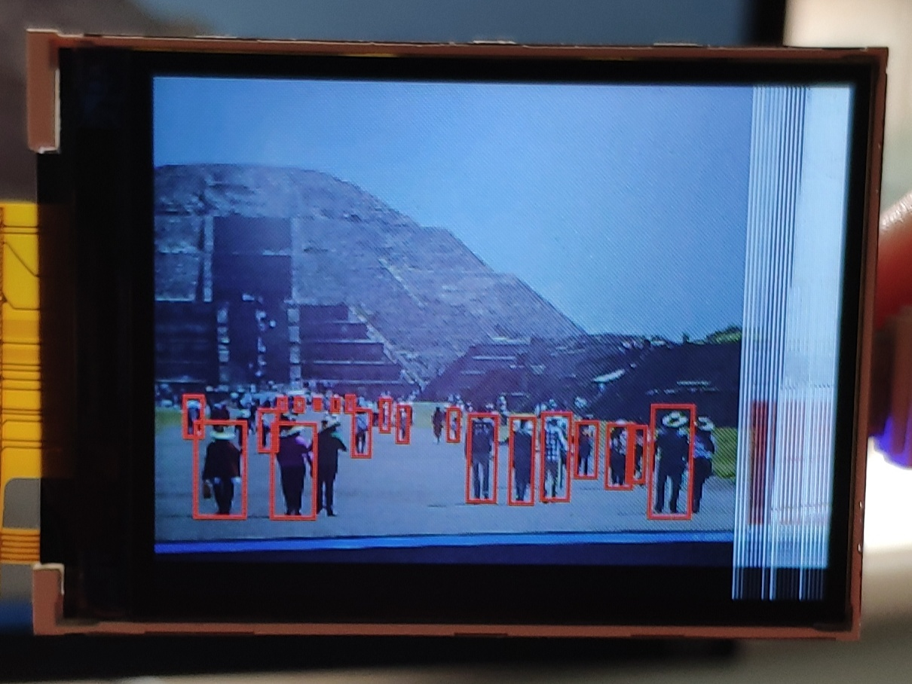

# Kendryte K210 Animal Tracking (Kendryte Standalone SDK)

## Demo



## Train

Train yolo model using [darknet](https://pjreddie.com/darknet/yolo/) or this [repo](https://gitee.com/zyayoung/keras-yolo3/tree/rat/).

To conver your keras model to kmodel, [MaixPy_scripts](https://github.com/sipeed/MaixPy_scripts) or [nncase](https://github.com/kendryte/nncase/tree/v0.1.0-rc5) can be used.

First prepare your `yolo.h5` file, then
```bash
tflite_convert --keras_model_file=yolo.h5 --output_file=yolo.tflite
./tflite2kmodel.sh yolo.tflite
```

## Usage

### Compile

- Ubuntu

Download `RISC-V 64bit toolchain for Kendryte K210_ubuntu_amd64` from https://kendryte.com/downloads/.

Extract it to /opt/riscv-toolchain, and add `export LD_LIBRARY_PATH=$LD_LIBRARY_PATH:/opt/riscv-toolchain/bin/` to `bashrc`.

```bash
mkdir build && cd build
cmake .. -DPROJ=yolo3_frame_test_public_maixpy -DTOOLCHAIN=/opt/riscv-toolchain/bin && make
```

- Windows

Download and install CMake and the latest toolchain.

```powershell
mkdir build && cd build
cmake -G "MinGW Makefiles" .. -DPROJ=yolo3_frame_test_public_maixpy -DTOOLCHAIN=/path/to/toolchain/bin
make
```

### flash

You will get `yolo3_frame_test_public_maixpy.bin`.

If you want to flash it in UOG, using `yolo3_frame_test_public_maixpy.bin`, then using flash-tool(s) burn it to your flash.

```bash
sudo kflash yolo3_frame_test_public_maixpy.bin -B dockE -p /dev/ttyUSB0 -b 3000000 -t
```

You may want to flash your bin and model toghther with kfpkg 

```bash
cp ../src/yolo3_frame_test_public_maixpy/kfpkg/kpu_yolov3.kfpkg .
zip kpu_yolov3.kfpkg yolo.kmodel yolo3_frame_test_public_maixpy.bin
sudo kflash kpu_yolov3.kfpkg -B dockE -p /dev/ttyUSB0 -b 3000000 -t
```

## Credit

- [Yolov3](https://pjreddie.com/darknet/yolo/)
- [kendryte-standalone-sdk](https://github.com/kendryte/kendryte-standalone-sdk)
- [keras-yolo3](https://github.com/qqwweee/keras-yolo3)
- [K210_Yolo_framework](https://github.com/zhen8838/K210_Yolo_framework)
- M. Lorbach, E. I. Kyriakou, R. Poppe, E. A. van Dam, L. P. J. J. Noldus, and R. C. Veltkamp, “Learning to Recognize Rat Social Behavior: Novel Dataset and Cross-Dataset Application,” Journal of Neuroscience Methods, 2017. [data](https://www.noldus.com/projects/phenorat/datasets/ratsi)
- [MaixPy_scripts](https://github.com/sipeed/MaixPy_scripts)
